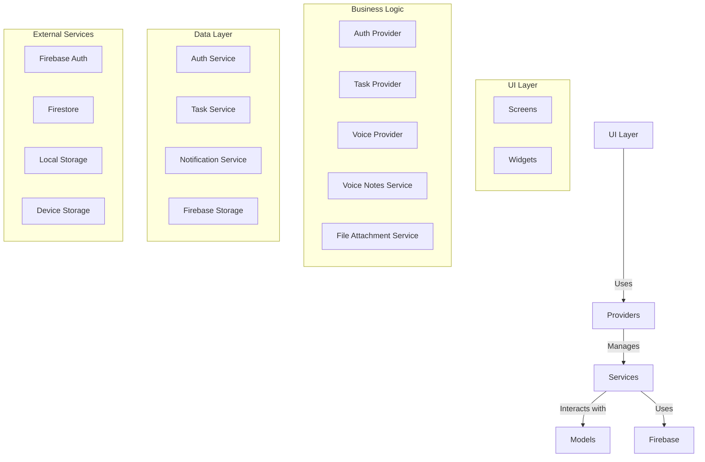

# Whisp Task Manager - Complete Documentation

## Table of Contents
1. [Project Overview](#project-overview)
2. [Directory Structure](#directory-structure)
3. [Core Components](#core-components)
4. [Features](#features)
5. [Development Guide](#development-guide)
6. [Testing](#testing)
7. [Building for Production](#building-for-production)
8. [Architecture Overview](#architecture-overview)
9. [Troubleshooting](#troubleshooting)
10. [Contributing](#contributing)
11. [License](#license)

## Project Overview
A Flutter-based task management application with voice control capabilities, user authentication, and real-time notifications.

## Directory Structure

### 1. Core Application
- `main.dart` - Application entry point, initializes providers and runs the app
- `lib/`
  - `models/`
    - `task.dart` - Task data model and related enums
    - `user_model.dart` - User data model and authentication state
  - `providers/`
    - `auth_provider.dart` - Manages user authentication state
    - `task_provider.dart` - Manages task state and business logic
    - `voice_provider.dart` - Handles voice command processing
    - `voice_notes_service.dart` - Handles voice recording, playback, and management
    - `file_attachment_service.dart` - Manages file attachments including uploads and downloads
  - `screens/`
    - `account_settings_screen.dart` - User account management
    - `add_task_screen.dart` - Task creation and editing
    - `change_password_screen.dart` - Password update functionality
    - `forgot_password_screen.dart` - Password recovery
    - `home_screen.dart` - Main dashboard
    - `login_screen.dart` - User authentication
    - `profile_screen.dart` - User profile management
    - `signup_screen.dart` - New user registration
    - `task_list_screen.dart` - Displays user's task list
    - `task_calendar.dart` - Calendar view for tasks with due dates
  - `services/`
    - `auth_service.dart` - Handles user authentication and account management
    - `file_attachment_service.dart` - Manages file attachments for tasks
    - `notification_service.dart` - Handles local and push notifications
    - `task_service.dart` - Manages task-related operations and data
    - `voice_notes_service.dart` - Handles voice recording and management
    - `voice_parser.dart` - Processes and interprets voice commands
    - `voice_service.dart` - Manages voice interaction features
  - `utils/`
    - `notification_helper.dart` - Helper methods for notifications
    - `validators.dart` - Input validation utilities
    - `voice_test_runner.dart` - Testing utilities for voice features
    - `theme.dart` - App theming and styling
  - `widgets/`
    - `auth_text_field.dart` - Custom text field for auth forms
    - `auth_wrapper.dart` - Handles auth state and routing
    - `file_attachments_widget.dart` - Displays and manages file attachments for tasks
    - `filter_dialog.dart` - Task filtering and sorting
    - `notification_test_widget.dart` - Notification testing UI
    - `password_strength_indicator.dart` - Visual password strength meter
    - `task_calendar.dart` - Calendar view for tasks and deadlines
    - `task_card.dart` - Reusable task item component
    - `user_avatar.dart` - Displays user profile picture or initials
    - `voice_notes_widget.dart` - UI component for recording and managing voice notes
    - `file_attachments_widget.dart` - UI component for managing file attachments

### 2. Platform-Specific Code
- `android/` - Android platform configuration
- `ios/` - iOS platform configuration
- `web/` - Web platform configuration
- `windows/` - Windows desktop configuration
- `macos/` - macOS desktop configuration
- `linux/` - Linux desktop configuration

### 3. Assets
- `assets/`
  - `images/` - App icons and images
  - `sounds/` - Notification sounds and audio feedback

## Core Components

### State Management
The app uses Provider pattern for state management with several providers:
- `AuthProvider`: Manages user authentication state
- `TaskProvider`: Handles task-related state and operations
- `VoiceProvider`: Manages voice command processing
- `VoiceNotesService`: Handles voice recording and playback
- `FileAttachmentService`: Manages file attachments

### Features
- **User Authentication**: Email/password sign-in and registration
- **Task Management**: Create, read, update, and delete tasks
- **Voice Notes**: Record and attach voice memos to tasks
- **File Attachments**: Attach files and images to tasks
- **Voice Commands**: Control the app using voice
- **Notifications**: Local notifications for task reminders
- **Calendar View**: Visualize tasks on a calendar
- **Cross-Platform**: Works on mobile, web, and desktop

## Development Guide

### Prerequisites
- Flutter SDK (latest stable version)
- Dart SDK (compatible with Flutter version)
- Firebase project (for authentication, storage, and database)
- Platform-specific setup for voice recording (microphone permissions, etc.)

### Setup Instructions
1. Clone the repository
2. Run `flutter pub get` to install dependencies
3. Configure Firebase:
   - Add your `google-services.json` to `android/app/`
   - Add your `GoogleService-Info.plist` to iOS/Runner/
4. Set up platform-specific configurations:
   - Android: Update `AndroidManifest.xml` with required permissions
   - iOS: Update `Info.plist` with usage descriptions for microphone and file access
5. Run `flutter run` to start the app

### Key Dependencies
- `record`: For audio recording functionality
- `just_audio`: For audio playback
- `firebase_storage`: For storing voice notes and file attachments
- `file_picker`: For selecting files and images
- `table_calendar`: For the calendar view
- `image_picker`: For capturing/selecting images

### Testing
Run tests using:
```bash
flutter test
```

### Building for Production
```bash
# For Android
flutter build apk --release

# For iOS
flutter build ios --release

# For Web
flutter build web --release
```

## Architecture Overview

The app follows a clean architecture with clear separation of concerns:



## New Features

### Voice Notes
- Record and attach voice memos to tasks
- Playback and manage voice recordings
- Transcribe voice to text (basic implementation)
- Store recordings locally and optionally in the cloud

### File Attachments
- Attach files and images to tasks
- Support for multiple file types
- Preview supported file types
- Local and cloud storage options

### Calendar View
- Visualize tasks on a calendar
- Filter tasks by date range
- View task details directly from the calendar

## Troubleshooting

### Common Issues
1. **Firebase Not Initialized**
   - Ensure Firebase configuration files are correctly placed
   - Verify Firebase dependencies in `pubspec.yaml`

2. **Build Failures**
   - Run `flutter clean` and `flutter pub get`
   - Ensure all dependencies are compatible

3. **Notification Issues**
   - Check notification permissions
   - Verify notification channel setup on Android

4. **Voice Recording**
   - Ensure microphone permissions are granted
   - Check platform-specific setup for audio recording

5. **File Access**
   - Verify storage permissions
   - Check file size limits and supported formats

## Contributing
1. Fork the repository
2. Create a feature branch
3. Make your changes
4. Write tests for new features
5. Submit a pull request

## License
[Specify your license here]
